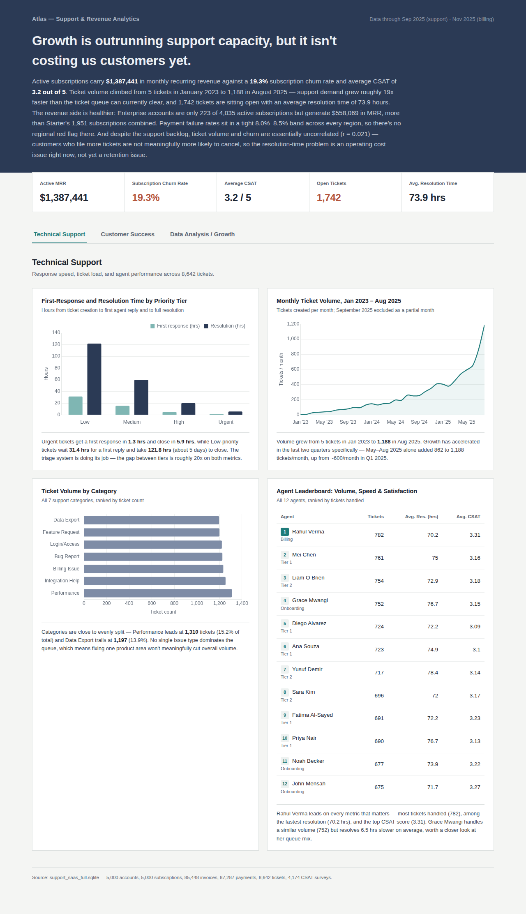
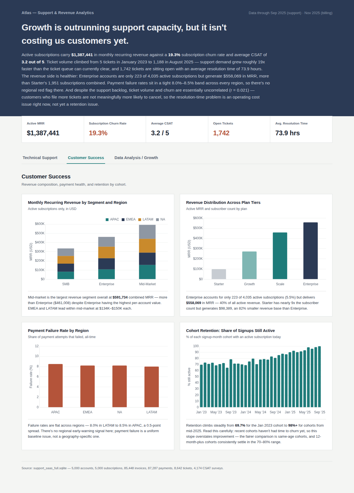
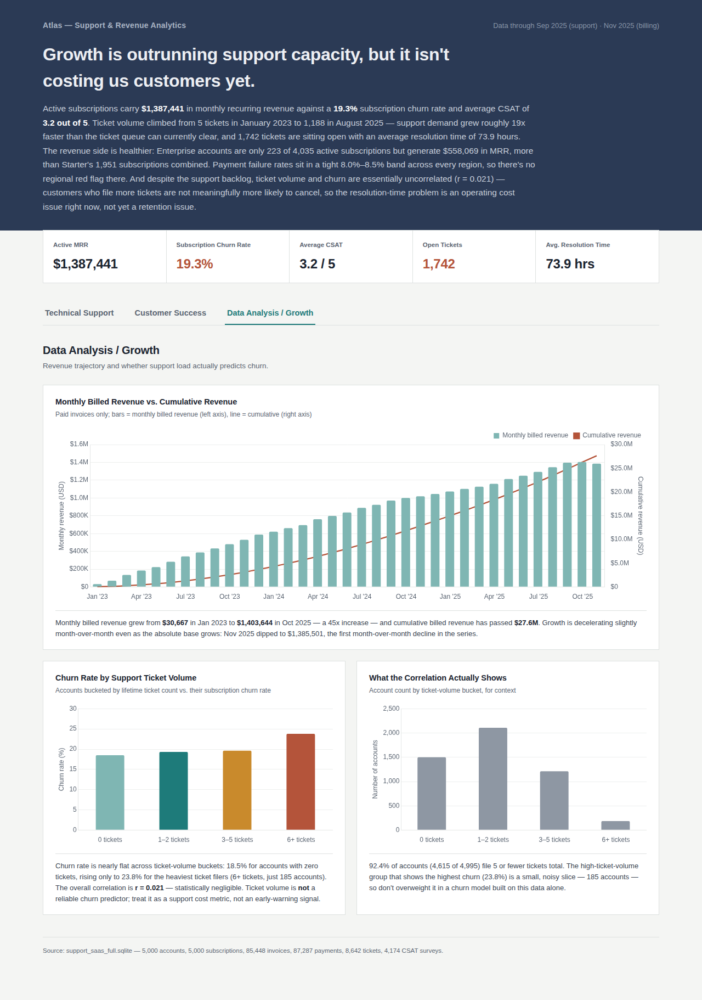

# SaaS Customer Support & Success Analytics (SQL Project)

A relational database simulating a SaaS company's billing, subscriptions, and
support operations — with SQL queries and an interactive dashboard covering
**Technical Support**, **Customer Success**, and **Data Analysis** metrics.

## Dashboard





Open `dashboard_final.html` in any browser to interact with it directly (no install needed).

## Files
- `support_saas_full.sqlite` — the database
- `queries.sql` — 15 SQL queries organized by role area
- `dashboard_final.html` — interactive dashboard (standalone, opens in any browser)
- `screenshots/` — static images of the dashboard for quick viewing
- `README.md` — this file

## Schema

| Table | Rows | Description |
|---|---|---|
| `plans` | 4 | Pricing tiers (Starter, Growth, Scale, Enterprise) |
| `accounts` | 5,000 | Customers — region, segment, acquisition channel |
| `subscriptions` | 5,000 | Links accounts to plans, status, MRR |
| `invoices` | 85,448 | Billing history |
| `payments` | 87,287 | Payment attempts |
| `agents` | 12 | Support agents *(synthetic)* |
| `support_tickets` | 8,642 | Tickets linked to real accounts *(synthetic)* |
| `csat_surveys` | 4,174 | Post-resolution satisfaction scores *(synthetic)* |

## Key Findings

**Revenue**
- Active MRR: **$1,387,441** across 4,035 active subscriptions
- Subscription churn rate: **19.3%** (965 cancelled of 5,000 total)
- Enterprise plan is only 5.5% of subscriptions (223 accounts) but drives **40% of active revenue** ($558K MRR) — revenue is heavily concentrated in a small account segment
- Mid-market is actually the largest revenue segment overall ($591,734 combined MRR), ahead of Enterprise, once you sum across all regions
- Monthly billed revenue grew **45x** from $30,667 (Jan 2023) to $1.4M (Oct 2025); cumulative billed revenue has passed $27.6M

**Support Operations**
- SLA tiering works as intended: Urgent tickets get first response in **1.3 hrs** vs **31.4 hrs** for Low priority — a ~20x gap, consistent across both first-response and resolution time
- Average resolution time overall: **73.9 hours**, with **1,742 tickets** currently open/pending
- Ticket volume grew ~19x faster than support capacity scaled (5 tickets/month in Jan 2023 → 1,188/month in Aug 2025), with acceleration specifically in the last two quarters
- No single ticket category dominates (7 categories, all between 13.9%–15.2% of volume) — meaning a single product fix wouldn't meaningfully cut ticket load
- Average CSAT: **3.2 / 5** — top agent (Rahul Verma) leads on volume, speed, and satisfaction simultaneously

**Churn & Retention Signal**
- Ticket volume and churn are **essentially uncorrelated (r = 0.021)** — customers who file more support tickets are not meaningfully more likely to cancel. This is a genuine (if counterintuitive) finding: it means ticket volume should be tracked as an operating-cost metric, not a churn early-warning signal
- Payment failure rate is flat across all regions (8.0%–8.5%) — no regional red flag
- Cohort retention looks like it improves over time (69.7% → 98%+), but this is partly a survivorship artifact since recent cohorts haven't had time to churn yet; same-age cohort comparison settles around 70-80% retention

## SQL skills demonstrated
`JOIN` (inner/left), `GROUP BY` / `HAVING`, subqueries, CTEs (`WITH`),
window functions (`RANK`, `ROW_NUMBER`, `LAG`, running `SUM() OVER`),
date arithmetic, conditional aggregation (`CASE WHEN` inside `SUM`/`AVG`).

## How to run it
```bash
sqlite3 support_saas_full.sqlite
.read queries.sql
```
Or open `dashboard_final.html` directly in a browser — no setup required.

## Notes on the data
The billing tables (`plans`, `accounts`, `subscriptions`, `invoices`, `payments`)
are real/original data. `agents`, `support_tickets`, and `csat_surveys` were
synthetically generated and keyed to the same `account_id`s, so findings
involving support-ticket data (e.g. the ticket-vs-churn correlation) reflect
patterns in generated data, not a live company — worth stating plainly if this
comes up in an interview.
